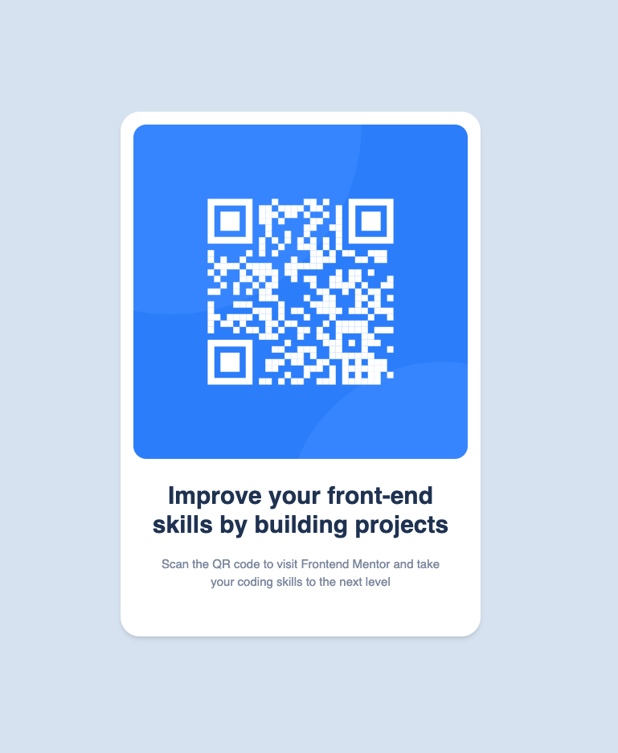

# Frontend Mentor - QR code component solution

This is a solution to the [QR code component challenge on Frontend Mentor](https://www.frontendmentor.io/challenges/qr-code-component-iux_sIO_H). Frontend Mentor challenges help you improve your coding skills by building realistic projects.

## Table of contents

- [Overview](#overview)
  - [Screenshot](#screenshot)
  - [Links](#links)
- [My process](#my-process)
  - [Built with](#built-with)
  - [What I learned](#what-i-learned)
  - [Continued development](#continued-development)
  - [Useful resources](#useful-resources)
- [Author](#author)
- [Acknowledgments](#acknowledgments)

**Note: Delete this note and update the table of contents based on what sections you keep.**

## Overview

### Screenshot

### Links

- Solution URL: [Add solution URL here](https://your-solution-url.com)
- Live Site URL: [Add live site URL here](https://your-live-site-url.com)

## My process

### Built with

- Semantic HTML5 markup
- [React](https://reactjs.org/) - JS library
- Tailwind CSS

### What I learned

I learned more about tailwind css and how to use it to style my html.

### Continued development

CSS Layouts

### Useful resources

- [Tailwind Components Cheatsheet](https://tailwindcomponents.com/cheatsheet/) - Great resource for tailwind styling.
- [ChatGPT](https://chatgpt.com/) - Personal coding assistant. This helped when I was stuck.
- [Cursor](https://www.trycursor.com/) - AI-powered Coding environment. First time using it. Very slick.
- [Vite](https://vitejs.dev/) - Frontend tooling for React. Helped me get up and running quickly.
- [Tailwind CSS](https://tailwindcss.com/) - CSS framework.
- [React](https://reactjs.org/) - JS library.

## Author

- Website - [Justin Levy](https://justlevy.com)
- Frontend Mentor - [@justinsane](https://www.frontendmentor.io/profile/justinsane)
- X - [@just_levy](https://www.twitter.com/just_levy)

## Acknowledgments

I want to thank ChatGPT for helping me with my coding questions. I also want to thank the Frontend Mentor team for providing the challenges that help me improve my coding skills.
